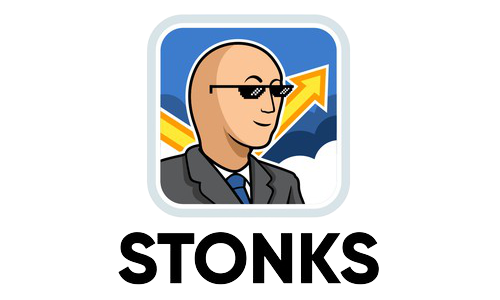
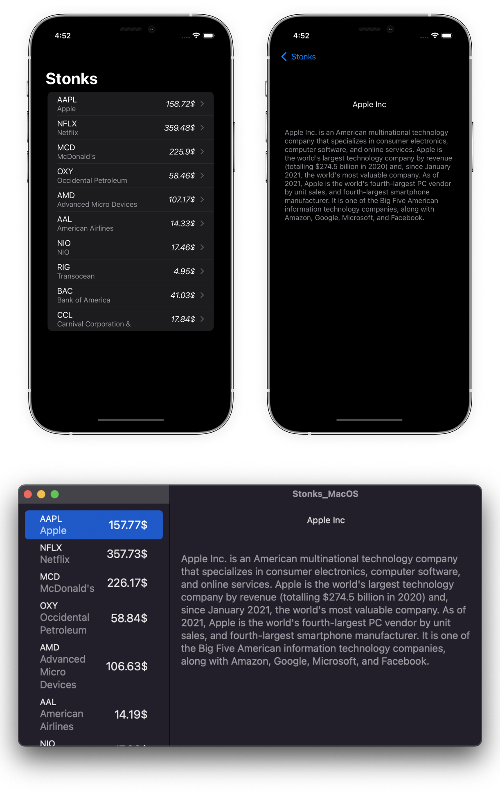

<p align="center">
  
</p>

## KMM_Stonks
This is a simple project that includes **Stonks** KMM library which is consumed by *iOS/MacOS/Android* apps. App uses *Yahoo Finance API* and *Alpha Vantage API* to fetch data.

## Installation
###### iOS and Android
This setup only requires [KMM plugin for Android Studio](https://plugins.jetbrains.com/plugin/14936-kotlin-multiplatform-mobile). This plugin allows to run iOS and Android apps directly from Android Studio.
P.S. But you can always open .xcodeproj and run iOS app without any additional setup, since framework is connected at runtime via Run Script in Build Phases.

###### Macos
In this case app can consume our framework in many different ways, but lets just say that we use [Multiplatform Swift Package plugin](https://github.com/ge-org/multiplatform-swiftpackage) that produces either XCFramework or whole SPM Package. To make things simple, just run this script in `commonMain` dir.
```kotlin
./gradlew createXCFramework
```
It will generate `swiftpackage` folder with XCFramework which you then connect in your MacOS app.
## 👤 Author
This framework is created by Sashko Potapov.

